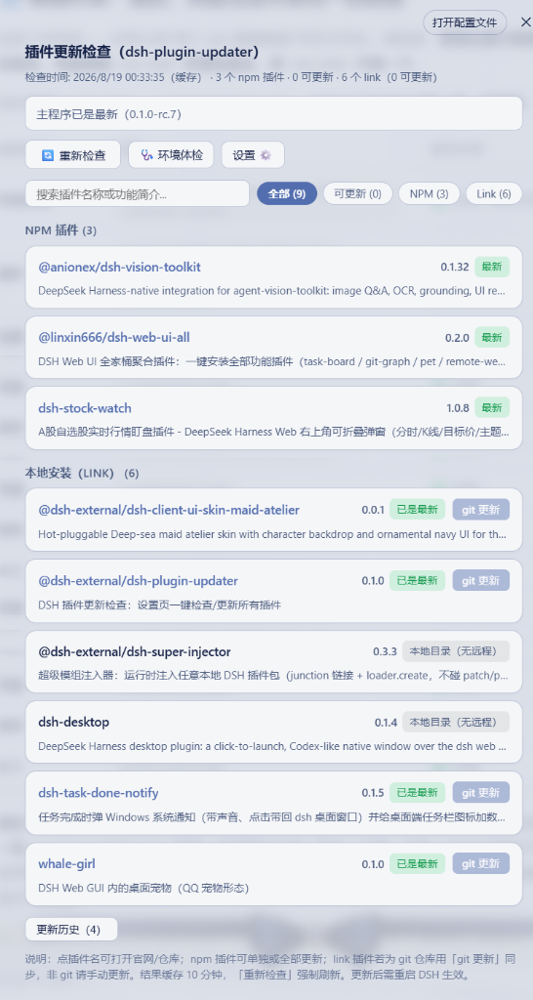
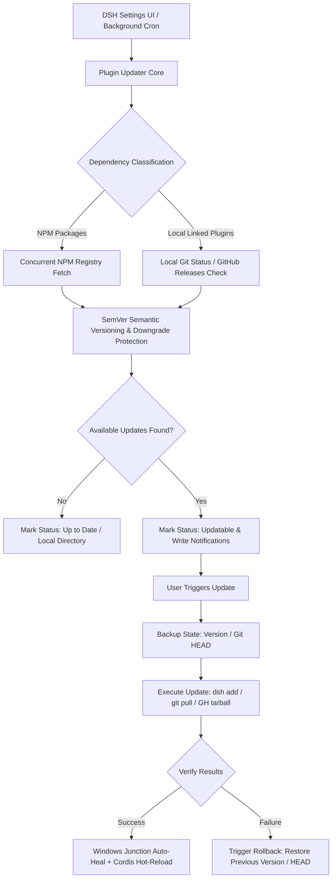

# @dsh-external/dsh-plugin-updater 🚀

<div align="center">

**[English](README.md)** | **[简体中文](README.zh-CN.md)**

<br/>


**An automated, resilient, and enterprise-grade plugin update & lifecycle management suite for DeepSeek Harness (DSH).**

[Features](#-key-features) • [Installation](#-quick-installation) • [Usage Guide](#-usage-guide) • [Architecture](#-architecture--safety-guardrails) • [Configuration](#-configuration) • [Development](#-development--build)

<br/>



</div>

---

## 📖 Introduction

In the DeepSeek Harness (DSH) ecosystem, developers and power users frequently manage a mix of **NPM packages** and **locally linked development plugins (Link)**. Manually verifying updates, dealing with broken Windows junctions, and troubleshooting update conflicts can be tedious and error-prone.

`dsh-plugin-updater` seamlessly integrates into the native DSH Settings panel, providing **dual-track detection, instant release notes preview, one-click rollback, hot-reload, self-healing diagnostic tools, and non-intrusive notification badges** to make plugin maintenance completely effortless.

---

## ✨ Key Features

### 🔍 1. Dual-Track Concurrency & Accurate SemVer Comparison
- **NPM Plugins**: Concurrently queries NPM registries (auto-resolves `.npmrc`), compares against locally installed versions using semantic versioning (supports `v` prefixes, `-beta`/`-rc` prereleases, and downgrade protection).
- **Link Local Plugins**: Automatically inspects local git repositories and tracks behind commits against remote `origin`. For non-git linked directories, parses `package.json` to verify against GitHub Releases.

### 📝 2. In-App Release Notes Preview
- Direct **`[Changelog]`** toggle next to updatable plugins.
- Fetches and renders detailed Markdown release notes from GitHub Releases.
- Clearly review bugfixes, breaking changes, and new features before updating.

### 🛡️ 3. Visual One-Click Rollback
- Automatically captures state snapshots (previous NPM version / Git commit HEAD) before each update.
- Offers a direct **`[↩ Rollback to vX.X.X]`** button in the update history log.
- Instantly downgrade to the previous working version if any compatibility issues arise.

### ⚡ 4. Cordis Hot-Reload & Fast Restart
- Automatically reconstructs Cordis plugin fibers upon successful updates (clears module caches → re-imports → registers plugins).
- Provides top notification banners with **`[🔄 Hot-Reload Now]`** and **`[📋 Copy Restart Command]`** to minimize friction.

### ⚙️ 5. Graphical Settings Panel
- Click **`[Settings ⚙️]`** in the toolbar to configure:
  - **Check Interval**: 1h, 3h, 6h (Recommended), 12h, 24h, or Manual Only.
  - **Notification Bell**: Toggle floating update alert bell.
  - **GitHub Token**: Configure personal access token to bypass anonymous 60 req/h rate limits.

### 📋 6. Multi-Selection Batch Updates & Instant Filtering
- Real-time millisecond-level fuzzy search by plugin name or description.
- Status filter pills: `All (N)`, `Updatable (N)`, `NPM (N)`, `Link (N)`, `Ignored (N)`.
- Multi-select checkboxes with **`[Update Selected (N)]`** and **`[Select All]`**.

### 🩺 7. Environment Health Doctor & Self-Healing
- Built-in **`[🩺 Health Doctor]`** scans the entire Profile dependency tree.
- Automatically detects and repairs broken Windows Junction symlinks caused by `pnpm`, and flags missing `node_modules` dependencies.

### 🔔 8. Zero-Distraction Floating Notification Bell
- **100% hidden when unread count is 0** to keep the workspace distraction-free.
- Slides out smoothly only when new updates are detected, with automatic position offset (`bottom: 76px; right: 20px;`) to avoid overlapping system taskbars.
- Supports one-click mark-as-read, clear-all, and direct navigation to Settings.

### 🎨 9. Full Dark/Light Theme Compatibility & Bilingual i18n
- 100% compliant with native DSH design tokens (`--dsw-*`).
- Dynamic language switcher (`🌐 English` / `🌐 简体中文`) with automatic browser locale detection.

---

## 📦 Quick Installation

### Method 1: Git Clone & Link (Recommended)

Run the following commands in your terminal:

```bash
git clone https://github.com/StarBits233/dsh-plugin-updater.git
dsh plugin --profile web add ./dsh-plugin-updater
```

### Method 2: Download Release Archive

1. Download the latest `Source code (zip)` from the [Releases Page](https://github.com/StarBits233/dsh-plugin-updater/releases).
2. Extract to any directory (e.g., `D:\DSHTools\dsh-plugin-updater`).
3. Link the extracted directory in DSH:
   ```bash
   dsh plugin --profile web add <path-to-extracted-folder>
   ```

---

## 🚀 Usage Guide

After installation, refresh DSH Web UI (`F5` or `Ctrl+R`):

1. **Access Updater Panel**:
   - Open DSH **Settings** → click **Plugin Updates** in the sidebar.
2. **Check & Update**:
   - Click **`🔄 Refresh`** to force re-fetch remote registries.
   - Click **`Changelog`** on any item to preview release notes.
   - Click **`Update`** or select multiple and click **`Update Selected`**.
3. **Diagnostics & Customization**:
   - Run **`🩺 Health Doctor`** to diagnose dependencies and heal broken junctions.
   - Open **`Settings ⚙️`** to adjust polling intervals and GitHub API tokens.

---

## 🛠️ Architecture & Safety Guardrails



### Safety Guardrails:
- **Junction Protection**: Windows `pnpm` operations can overwrite junctions. The updater verifies and heals symlink junctions after every operation.
- **Git Stash Guard**: Checks for uncommitted changes before resetting git repos; automatically stashes dirty states to protect your local work.
- **DSH Core Lock**: Updating `@deepseek-ai/dsh` core is guarded by `allowCoreUpdates` (disabled by default) to prevent accidental runtime interruptions.

---

## ⚙️ Configuration

| Parameter | Type | Default | Description |
| :--- | :--- | :--- | :--- |
| `profile` | `string` | `"web"` | Target DSH profile name |
| `checkIntervalMs` | `number` | `21600000` (6h) | Polling interval in ms (0 to disable background checks) |
| `notifyNewUpdates` | `boolean` | `true` | Show floating notification bell when updates are found |
| `allowCoreUpdates` | `boolean` | `false` | Allow updating DSH core host package (High risk, disabled by default) |
| `fetchTimeoutMs` | `number` | `8000` | Network request timeout in milliseconds |
| `githubToken` | `string` | `""` | GitHub Personal Access Token for higher API rate limits |

---

## 💻 Development & Build

This project is built with TypeScript, Cordis, and Tsdown:

```pwsh
# 1. Build host JS and client bundle
powershell -NoProfile -ExecutionPolicy Bypass -File scripts\build.ps1

# 2. Run test suite (covers semver, registry, git, store, updater, etc.)
npm test

# 3. Type checking
npm run typecheck
```

---

## 📄 License

Distributed under the [BSD-3-Clause License](LICENSE).

---

<div align="center">

Made with ❤️ by [StarBits233](https://github.com/StarBits233)

</div>
