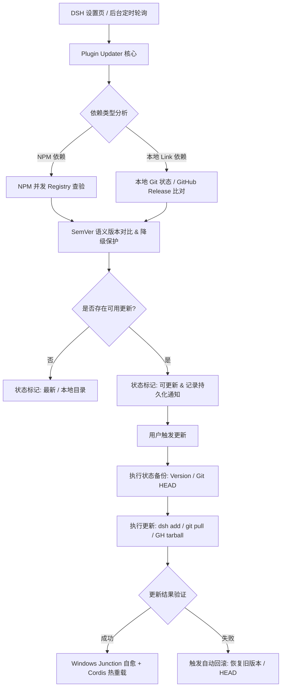

# @dsh-external/dsh-plugin-updater 🚀

<div align="center">

**[English](README.md)** | **[简体中文](README.zh-CN.md)**

<br/>


**专为 DeepSeek Harness (DSH) 打造的全自动化、安全可靠的插件更新与依赖生命周期管理套件。**

[功能特性](#-核心特性) • [快速安装](#-快速安装) • [使用指南](#-使用指南) • [架构设计](#-底层架构与安全护栏) • [配置说明](#-配置说明) • [贡献与构建](#-开发与构建)

<br/>


</div>

---

## 📖 简介

在 DeepSeek Harness (DSH) 的生态使用中，用户通常会同时安装大量的 **NPM 官方/社区插件** 与 **本地开发态/源码链接插件（Link）**。手动检查每个插件是否有更新、排查更新失败与解决 Windows 软链断裂往往耗时费力。

`dsh-plugin-updater` 是一个深度整合进 DSH 设置界面的官方级体验扩展，提供**双轨智能检测、更新日志预览、一键安全回滚、热重载即时生效、环境自愈体检与智能隐身通知**，让插件的更新与维护变得如丝般顺滑。

---

## ✨ 核心特性

### 🔍 1. 双轨并发检测与精确 SemVer 比对
- **NPM 插件**：并发请求 NPM 官方源 / 国内镜像源（自动读取 `.npmrc`），与本地 `node_modules` 实际安装版本进行标准化 SemVer 比对（支持 `v` 前缀、`-beta`/`-rc` 预发布语义分析与降级保护）；
- **Link 本地插件**：自动深入本地源码目录，智能识别 Git 仓库分支并与远端 `origin` 进行落后检测（`Behind Commits`）；无 Git 时自动解析 `package.json` 中的 `repository` 字段连接 GitHub Releases 校验。

### 📝 2. 版本更新日志（Release Notes）即时预览
- 在可更新插件旁边直接提供 **`[说明]`** / **`[日志]`** 展开卡片；
- 自动拉取对应 GitHub Release Notes 详细 Markdown 说明，并在卡片内优雅排版渲染；
- 更新前一眼看清修复了什么 Bug、新增了什么特性，告别盲目升级。

### 🛡️ 3. 可视化「一键版本回滚」与故障自愈
- 每次更新自动备份前序版本状态（NPM 版本号 / Git HEAD Commit）；
- 在「更新历史」面板中对历史升级提供直观的 **`[↩ 回滚到 vX.X.X]`** 按钮；
- 升级遇到兼容性 Bug 随时一键安全降级回原版本。

### ⚡ 4. 插件热重载与免重启引导
- 更新成功后自动重建 Cordis Fiber（清除模块缓存 → 重新 import → 重建 Plugin Registry），尽可能实现免重启生效；
- 界面提供 **`[🔄 立即热重载]`** 与 **`[📋 复制重启命令]`** 快捷条，极大缩短操作链路。

### ⚙️ 5. 可视化配置面板（免改配置文件）
- 顶部工具栏点击 **`[设置 ⚙️]`** 即可展开图形化配置：
  - **自动检查周期**：下拉选择（1h / 3h / 6h 推荐默认 / 12h / 24h / 仅手动检查）；
  - **右下角站内通知**：一键开启 / 关闭；
  - **GitHub Token**：界面直接填入 Token，突破 GitHub API 每小时 60 次的匿名请求配额。

### 📋 6. 多选批量更新 & 插件即时筛选
- 支持按插件名称、功能简介（Description）进行即时毫秒级搜索；
- 状态分类胶囊标签：`全部 (N)`、`可更新 (N)`、`NPM (N)`、`Link (N)`、`已忽略 (N)`；
- 支持 Checkbox 多选勾选，实现 **`[更新所选 (N)]`** 与 **`[全选 / 取消全选]`**。

### 🩺 7. 插件环境「健康体检 / 依赖自愈」
- 提供 **`[🩺 环境体检]`** 工具，一键诊断 Profile 目录下的完整依赖树；
- 自动检测并自愈修复 Windows 下被 pnpm 破坏的 Junction 软链，扫描缺失的 `node_modules` 模块。

### 🔔 8. 零打扰智能悬浮通知铃铛
- **0 未读时 100% 完全隐身**，绝不遮挡主界面任何内容；
- 仅在后台检测到新版本时优雅滑出黄色铃铛与红点未读数字；
- 坐标自动向上避让右下角系统任务胶囊（`bottom: 76px; right: 20px;`），杜绝 UI 冲突；
- 支持「一键已读」与「物理清空」，点击任意通知行直接跳转打开设置更新页。

### 🎨 9. 原生设计令牌与浅色/深色主题无缝切换
- 100% 对接 DSH 原生 Design Tokens（`--dsw-*`）；
- 完美自适应浅色模式（Light Mode）与深色模式（Dark Mode），字号与排版层级精致细腻。

---

## 📦 快速安装

### 方式一：Git 克隆并链接（推荐，后续可通过本插件自更新）

在终端中执行以下命令克隆到本地并链接至 DSH：

```bash
git clone https://github.com/StarBits233/dsh-plugin-updater.git
dsh plugin --profile web add ./dsh-plugin-updater
```

### 方式二：下载 Release 压缩包

1. 前往 [Releases 页面](https://github.com/StarBits233/dsh-plugin-updater/releases) 下载最新的 Source code (zip)；
2. 解压至本地任意目录（例如 `D:\DSHTools\dsh-plugin-updater`）；
3. 在 DSH 终端执行：
   ```bash
   dsh plugin --profile web add <解压目录绝对路径>
   ```

---

## 🚀 使用指南

安装完成后，刷新 DSH Web 客户端（`F5` 或 `Ctrl+R`）即可：

1. **进入插件更新面板**：
   - 打开 DSH **「设置」** → 左侧菜单点击 **「插件更新」** 标签页；
2. **执行检查与更新**：
   - 点击 **「🔄 重新检查」** 强制刷新远程源；
   - 点击插件右侧的 **「说明」** 预览 Release Notes；
   - 点击 **「更新」** 或勾选后点击 **「更新所选」** 执行自动化更新；
3. **环境维护与设置**：
   - 点击 **「🩺 环境体检」** 排查软链与依赖异常；
   - 点击 **「设置 ⚙️」** 调整检查周期与 GitHub Token。

---

## 🛠️ 底层架构与安全护栏



### 安全护栏设计：
- **Junction 软链保护**：Windows 下运行 `pnpm` 容易覆盖符号链接，插件在每次更新后均会自动扫描并自愈恢复 link 软链；
- **Git 暂存保护**：在执行 `git reset --hard` 前检测工作区状态，有未提交代码时自动触发 `git stash` 安全保护；
- **核心包安全锁**：对 DSH 主程序（`@deepseek-ai/dsh`）设有限制开关（`allowCoreUpdates`，默认关闭），防止误操作破坏运行宿主。

---

## ⚙️ 配置说明

| 配置字段 | 类型 | 默认值 | 描述 |
| :--- | :--- | :--- | :--- |
| `profile` | `string` | `"web"` | 目标 DSH Profile 名称 |
| `checkIntervalMs` | `number` | `21600000` (6h) | 自动后台轮询检测间隔（毫秒），0 为仅手动检查 |
| `notifyNewUpdates` | `boolean` | `true` | 检测到新版本时是否在右下角弹出悬浮通知铃铛 |
| `allowCoreUpdates` | `boolean` | `false` | 是否允许更新 DSH 托管核心包（高危操作，默认关闭） |
| `fetchTimeoutMs` | `number` | `8000` | 网络请求超时时间（毫秒） |
| `githubToken` | `string` | `""` | GitHub Personal Access Token，用于提升 API 请求速率 |

---

## 💻 开发与构建

本项目采用 TypeScript + Cordis + Tsdown 构建：

```pwsh
# 1. 编译构建（生成 host 纯 JS 与 client 打包 bundle）
powershell -NoProfile -ExecutionPolicy Bypass -File scripts\build.ps1

# 2. 运行单元测试套件（覆盖 semver / registry / git / store / updater 等 22 项单测）
npm test

# 3. 类型安全检查
npm run typecheck
```

---

## 📄 开源协议

本项目基于 [BSD-3-Clause License](LICENSE) 开源协议分发与使用。

---

<div align="center">

Made with ❤️ by [StarBits233](https://github.com/StarBits233)

</div>
